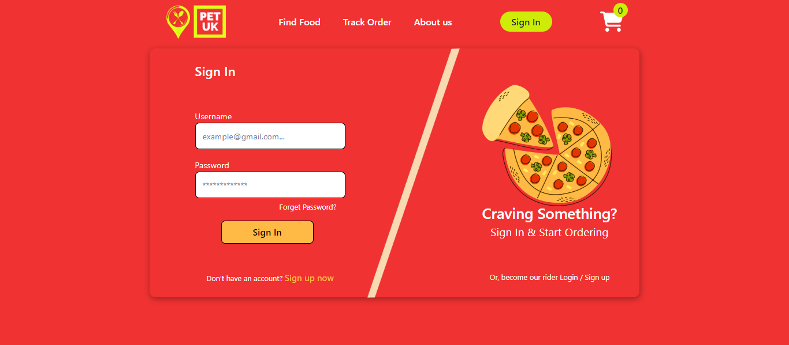

# Petuk: Online Food Ordering Platform

Petuk is an online food ordering platform built with React.js for the front-end, Node.js for the back-end, and MySQL for database management. It provides users with a seamless and intuitive way to order food from their favorite restaurants.




## Features

- **User Authentication**: Secure login and registration system to ensure user privacy.
- **Restaurant Listings**: Browse through a wide range of restaurants available on the platform.
- **Advanced Search**: Find restaurants and dishes quickly with advanced search and filtering options.
- **Detailed Menus**: View detailed menus of restaurants, including descriptions, prices, and images.
- **Order Placement**: Easily add items to the cart, customize preferences, and proceed to checkout.
- **Real-time Order Tracking**: Track order status in real-time from preparation to delivery.
- **Secure Payments**: Multiple payment options available for secure transactions.
- **Order History**: View past orders and reorder favorite items with ease.

## Technologies Used

- **Front-end**: React.js
- **Back-end**: Node.js
- **Database**: MySQL

## Installation

1. Clone the repository: `git clone https://github.com/fajlay-rabbi/petuk.git`
2. Navigate to the project directory: `cd petuk`
3. Install dependencies for the client and server:
   ```bash
   cd client
   cd petuks
   npm install
   cd ../server
   npm install
   ```
4. Configure the MySQL database according to the schema provided.
5. Start the server: `npm start` (in the server directory)
6. Start the client: `npm start` (in the client directory)
7. Visit `http://localhost:3000` in your browser to access the application.

## Contributing

Contributions are welcome! Please fork the repository and submit a pull request.

## License

This project is licensed under the [MIT License](LICENSE).

